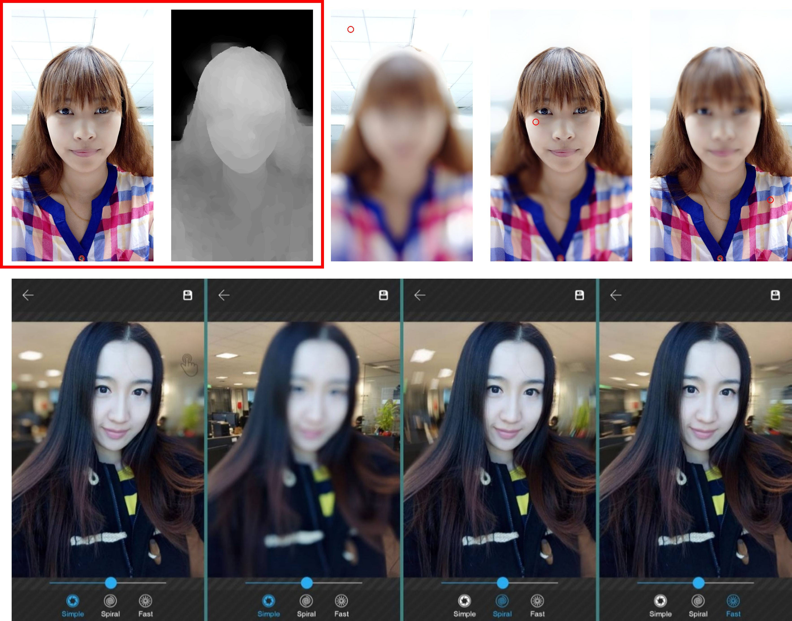
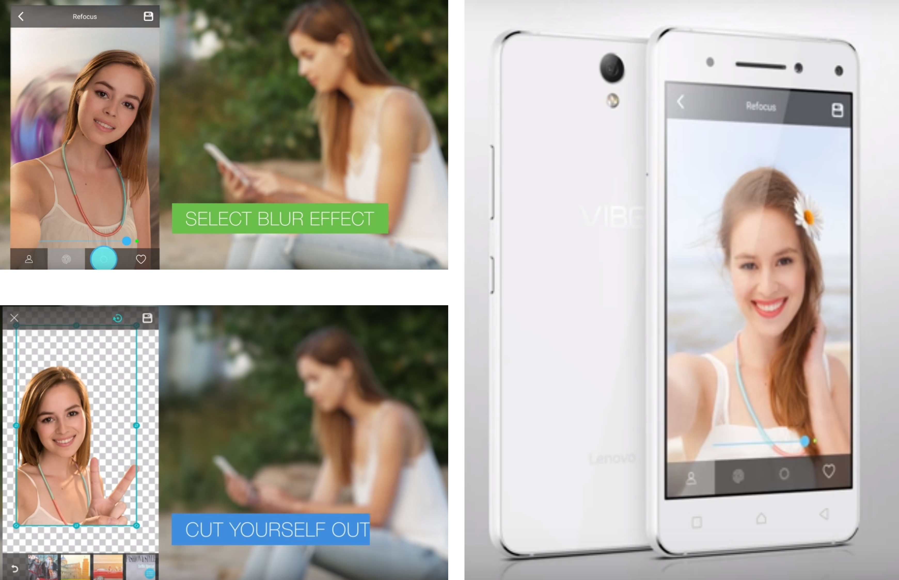






<link rel="stylesheet" href="/glyphicons/css/glyphicons.css">

<h1 style="text-align:center;">3D Camera: RGBD Image Algorithms for Dual-camera Mobile Phone, </h1>
<h1 style="text-align:center;">Lenovo VIBE S1</h1>

---

	<a href="http://i.cs.hku.hk/~cwang/">Chuan Wang</a>1
	&nbsp;&nbsp;&nbsp;&nbsp;
	<a href="http://herohuyongtao.github.io/">Yongtao Hu</a>1

	1Lenovo Group Limited, Hong Kong

	
	&nbsp;&nbsp;&nbsp;&nbsp;
	

	Figure: Left: The first row illustrates the idea of the refocus algorithm. Given the RGBD image as shown in the red box, after the user specifies a new refocus point, our algorithm will re-blur the image with a spatial-varying kernel, whose parameters would be calculated based on the depth information. Three results are shown on the right. The second row shows the Android app in the prototype of [Lenovo VIBE S1](https://www.amazon.com/Lenovo-FREE-DUAL-SIM-5inch-LTE-1-7GHz-Processor-3GB/dp/B017U1OILI). \\
	Right: The final shipped products, including refocus and cutout.

### Abstract

	We developed a 3D camera app in Android system, which can produce refocus effect and support selfie auto-cutout. Specifically, in the refocus algorithm, we utilize the depth information to blur the image to simulate an effect of "large aperture, shallow depth of field". The idea of the algorithm is simple, but the main challenge is how to deploy it into mobiles with real-time interaction. To this end, we developed efficient algorithms and applied parallel computing (OpenCL) to make it work. I also participated in developing the other feature, i.e. automatic selfie cutout, which is based on image matting. Similarly, to make it run fast in mobiles, over-segmentation, region-wise matting and parallel processing are involved to save memory and speed up the program.

---

### Video Demo

<iframe width="100%" height="480" src="https://www.youtube.com/embed/8gFGsBY3rzg" frameborder="0" allowfullscreen></iframe>

---

<!--<table style="width:100%">
<col width="20%">
<col width="10">
<col >

</table>-->

