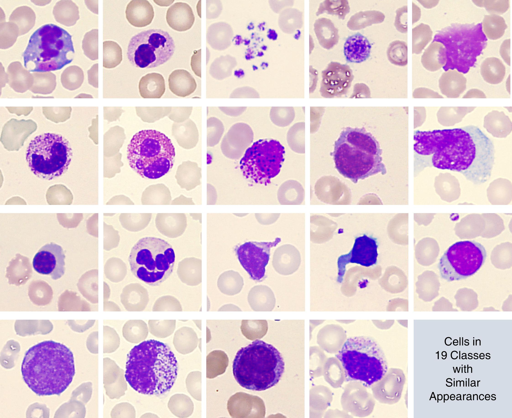
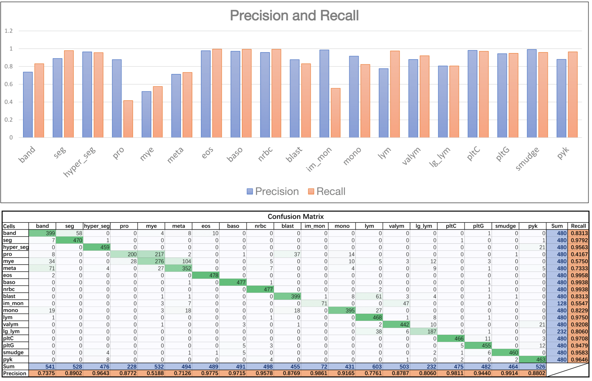






<link rel="stylesheet" href="/glyphicons/css/glyphicons.css">

<h1 style="text-align:center;">Blood Cell Classification via CNN and Hard Negative Mining</h1>

---

	<a href="http://i.cs.hku.hk/~cwang/">Chuan Wang</a>1

	1Lenovo Group Limited, Hong Kong

	
	

	Figure: Left: The blood cell image samples in 19 classes, provided by our customer. Right: The precision and recall for each class and the confusion matrix based on our training result. Note: we just release a result of around accuracy 86%, while the final solution released to our customer is over 90%.

### Abstract

	We applied neural network to solve blood cell classification problem, based on data provided by Lenovo's external customer, a famous medical device manufacturer in China. The blood cells are in 19 classes, most of which share similar appearance. So we first developed a CNN-based classification network for it, and then applied Hard Negative Mining to tackle classes with low accuracies. The final solution released to our customer achieves over 90% accuracy on average, and will be directly embedded into our customer's products.

---

<!--<table style="width:100%">
<col width="20%">
<col width="10">
<col >

</table>-->

