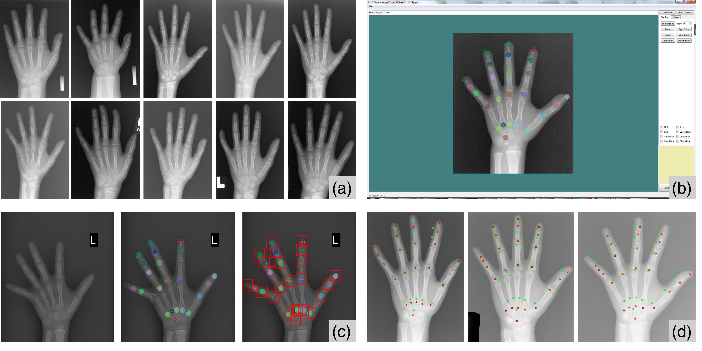






<link rel="stylesheet" href="/glyphicons/css/glyphicons.css">

<h1 style="text-align:center;">Bone Age Analysis via Deep Regression Networks</h1>

---

	<a href="http://i.cs.hku.hk/~cwang/">Chuan Wang</a>1

	1Lenovo Group Limited, Hong Kong

	

	Figure: (a) X-ray hand image samples in our training dataset. (b) A Qt-based GUI I developed to annotate the hand joints of a hand image. (c) The algorithm extracts ROIs at the hand joint locations to form a 25-channel image for regression to age. Moreover, the location information also helps me build an end-to-end location regression network to automatically locate the joints given an image. (d) With the auto-detected joint locations, I applied Active Appearance Model (AAM) to refine the joint locations. Green points: joint locations detected by location network; Red points: joint locations refined by AAM. 

### Abstract

	We applied deep regression networks to solve bone age analysis problem, based on data provided by Shanghai Children's Hospital, China. The ages range from 2 to 11 years old, with tiny appearance variations.

	To tackle the problems, I built two regression networks, one for detecting the hand joints given an image called Location Regression Network (LRN), and the other one for age regression, i.e. Age Regression Network (ARN). I achieved 86% accuracy with tolerance < 2 years with training data limited to 1000 samples. With this result, the project received an award from the host organization. 

	The LRN's output, joint locations of the hand may be inaccurate, which would be further refined by Active Appearance Model (See library [`menpofit`](https://github.com/menpo/menpofit)). Also, since the original dataset contains no location information of the joints, I developed a Qt-based GUI to annotate them manually. This GUI project is now released on GitHub.

---

### Code

<table style="width:600px">

<tr>
<td markdown="1">

||<em class="icon-github"/>||[Code (The Qt-based annotation tool with GUI)](https://github.com/wangchuan/Qt-GUI-Startup-Project)||

</td> 
</tr>

</table>

---

<!--<table style="width:100%">
<col width="20%">
<col width="10">
<col >

</table>-->

