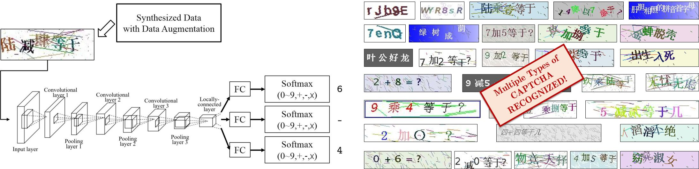






<link rel="stylesheet" href="/glyphicons/css/glyphicons.css">

<h1 style="text-align:center;">CAPTCHA Cracking: A CNN Based OCR Module for Web Crawler</h1>

---

	<a href="http://i.cs.hku.hk/~cwang/">Chuan Wang</a>1

	1Lenovo Group Limited, Hong Kong

	

	Figure: Left: The pipeline of our CAPTCHA recognition system. Right: We trained multiple models for various types of CAPTCHAs, including Chinese based, English based and math based.

### Abstract

	We applied neural network to solve CAPTCHA recognition problem. Since CAPTCHA usually contains lots of noise and overlapped characters, the idea of segmentation would not work well. So an end-to-end solution is more powerful. In this project, we extended single-label classification to multi-label classification in CNN, and applied it into text recognition in a single image as CAPTCHA. Such an end-to-end solution avoids image segmentation for a single character. To train the model well and avoid overfitting when model applied to real data, we applied data augmentation to synthesize the data, including adding noise, render in various styles, etc.

---

### Code
<table style="width:600px">

<tr>
<td markdown="1">

||<em class="icon-github"/>||[Code](https://github.com/wangchuan/Captcha-TensorFlow)||

</td> 
</tr>

</table>

---

<!--<table style="width:100%">
<col width="20%">
<col width="10">
<col >

</table>-->

