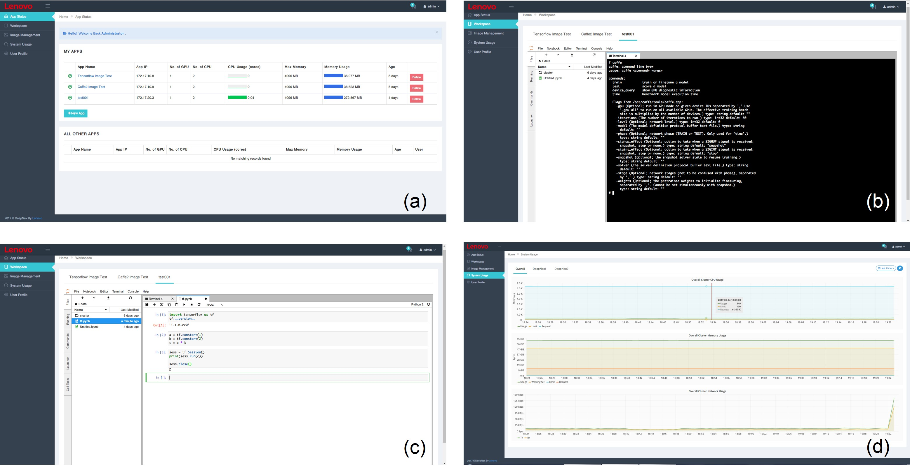






<link rel="stylesheet" href="/glyphicons/css/glyphicons.css">

<h1 style="text-align:center;">Lenovo DeepNEX: A Distributed Multi-tenant Private Cloud for Deep Learning Development</h1>

---

	<a href="http://i.cs.hku.hk/~cwang/">Chuan Wang</a>1
	&nbsp;&nbsp;&nbsp;&nbsp;
	Yaoman Li1
	&nbsp;&nbsp;&nbsp;&nbsp;
	Min Wang1
	&nbsp;&nbsp;&nbsp;&nbsp;
	Yi Yang1
	&nbsp;&nbsp;&nbsp;&nbsp;
	<a href="http://www.jiachen.org/">Jia Chen</a>1

	1Lenovo Group Limited, Hong Kong

	

	Figure: (a) The dashboard view of DeepNEX, showing all containers the user created. (b) System resource monitor view. (c) Run TensorFlow in Jupyter Notebook. (d) Run Caffe command line in Terminal.

### Abstract

	We developed a distributed multi-tenant private cloud platform for users who are interested in deep learning development. Our system runs in a cluster and supports multiple users to develop and run deep learning programs simultaneously. In our system, GPUs, CPUs and Memory can be well assigned by administrator in a web interface. And our system supports multiple mainstream toolkits like Caffe, TensorFlow, MXNet. Users can directly call these toolkits without any boring configurations.

	To support the development and sales of our system, I refactored various deep learning projects for demonstration and easy usage to our customers. These demo code include: 

<ul>
  <li>Image / text sentiment classification</li>
  <li>Image-to-image translation by CGAN</li>
  <li>Image recolorization by autoencoder</li>
</ul>  

etc., during which I also leart the related techniques.

---

### Promotion

	Our product is on sale and has attracted many potential customers since 2016, and we have already obtained many orders. Customers include universities, institutes and companies around the Greater China. Please contact Dr. Jun Luo at `jluo1 (at) lenovo (dot) com` for details and trail.

---

### Code and Tutorials

<table style="width:600px">

<tr>
<td markdown="1">

||<em class="icon-github"/>||[Code (Comming Soon)]()||
||<em class="icon-keynote"/>||[Tutorial Slides (Comming Soon)]()||

</td> 
</tr>

</table>

---

<!--<table style="width:100%">
<col width="20%">
<col width="10">
<col >

</table>-->

