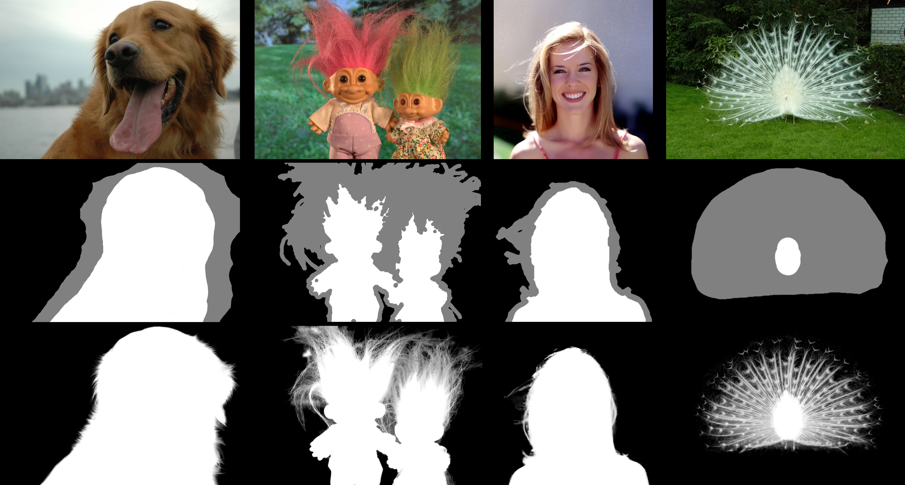






<link rel="stylesheet" href="/glyphicons/css/glyphicons.css">

<h1 style="text-align:center;">An Implementation of Robust Matting Algorithm</h1>

---

	<a href="http://i.cs.hku.hk/~cwang/">Chuan Wang</a>1

	1The University of Hong Kong, Hong Kong

	

	Figure: Rows from top to bottom: the original images, the trimaps and the computed matting results.

### Abstract

	When I started my Ph.D in HKU in 2010, my graphics group needed a soft image segmentation tool to cut out the land part from the satellite maps of Hong Kong. So it became my training project to implement such a robust matting algorithm, based on Dr. Jue Wang's paper "Optimized Color Sampling for Robust Matting". From this project, I learnt the usages of libraries like `OpenCV` and `QT`, as well as wrote my own sparse matrix library which supports dynamic entry update and feeding into Intel MKL to use its multithreading linear solver. Recently I sorted out the code and applied [`Eigen`](http://eigen.tuxfamily.org/index.php?title=Main_Page) to solve the linear system by its built-in Conjugate Gradient method. Note the shared code is in command line, a bit different with my original implementation with a GUI.

---

### Code
<table style="width:600px">

<tr>
<td markdown="1">

||<em class="icon-github"/>||[Code (command-line only)](https://github.com/wangchuan/RobustMatting)||

</td> 
</tr>

</table>

---

### Reference
- Jue Wang, Michael F. Cohen, "Optimized Color Sampling for Robust Matting", *IEEE Conference on Computer Vision and Pattern Recognition, 2007*.

<!--<table style="width:100%">
<col width="20%">
<col width="10">
<col >

</table>-->

