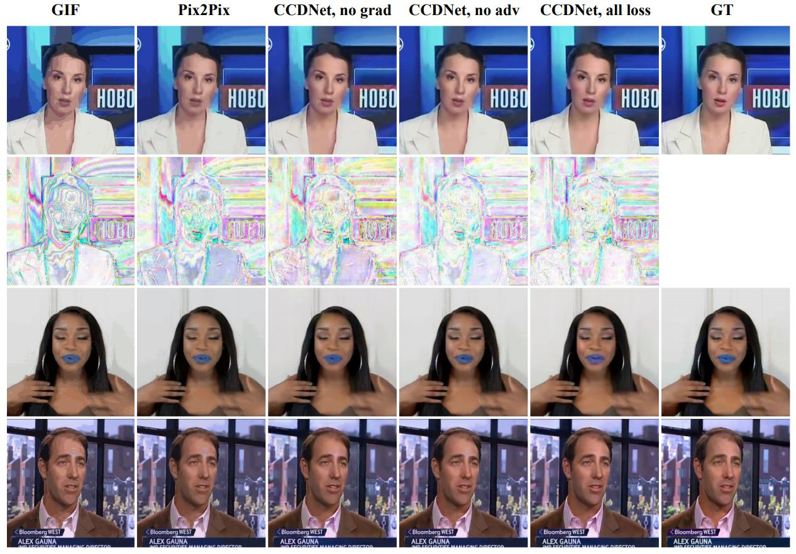






<link rel="stylesheet" href="/glyphicons/css/glyphicons.css">

<h1 style="text-align:center;">GIF2Video: Color Dequantization and Temporal Interpolation of GIF images</h1>

---

<p style="text-align:center;">
	<a href="http://yangwangx.com/">Yang Wang</a><sup>1</sup>&nbsp;
	<a href="https://brotherhuang.github.io/">Haibin Huang</a><sup>2</sup>&nbsp;
	<a href="/index.html">Chuan Wang</a><sup>2</sup>&nbsp;
	<a href="https://tonghehehe.com/">Tong He</a><sup>3</sup>&nbsp;
	<a href="http://www.juew.org/">Jue Wang</a><sup>2</sup>&nbsp;
	<a href="https://www3.cs.stonybrook.edu/~minhhoai/index.html">Minh Hoai</a><sup>1</sup>&nbsp;
</p>

<p style="text-align:center;">
	<sup>1</sup>Stony Brook University&nbsp;&nbsp;&nbsp;&nbsp;&nbsp;&nbsp;&nbsp;&nbsp;&nbsp;&nbsp;
	&nbsp;&nbsp;&nbsp;&nbsp;&nbsp;
	<sup>2</sup>Megvii (Face++) USA&nbsp;&nbsp;&nbsp;&nbsp;&nbsp;&nbsp;&nbsp;&nbsp;&nbsp;&nbsp;
	&nbsp;&nbsp;&nbsp;&nbsp;&nbsp;
	<sup>3</sup>UCLA
</p>

<p style="text-align:center;">
	<i>Accepted by CVPR 2019</i>
</p>

<p style="text-align:center;">
	<i>arXiv <a href="https://arxiv.org/abs/1901.02840">https://arxiv.org/abs/1901.02840</a></i>
</p>

<p style="margin-bottom: 30px; text-align:center;">
	
  Figure: Qualitative Results of GIF Color Dequantization on GIF-Faces. Pix2Pix and CCDNet trained without image gradientbased losses cannot remove quantization artifacts such as flat regions and false contours very well. Training CCDNet with adversarial loss yields more realistic and colorful images (see the color of the skin and the lips). Best viewed on a digital device.
</p>

### Abstract
<p style="text-align: justify;
    text-justify: inter-word;">
  Graphics Interchange Format (GIF) is a highly portable graphics format that is ubiquitous on the Internet. Despite their small sizes, GIF images often contain undesirable visual artifacts such as flat color regions, false contours, color shift, and dotted patterns. In this paper, we propose GIF2Video, the first learning-based method for enhancing the visual quality of GIFs in the wild. We focus on the challenging task of GIF restoration by recovering information lost in the three steps of GIF creation: frame sampling, color quantization, and color dithering. We first propose a novel CNN architecture for color dequantization. It is built upon a compositional architecture for multi-step color correction, with a comprehensive loss function designed to handle large quantization errors. We then adapt the SuperSlomo network for temporal interpolation of GIF frames. We introduce two large datasets, namely GIF-Faces and GIF-Moments, for both training and evaluation. Experimental results show that our method can significantly improve the visual quality of GIFs, and outperforms direct baseline and state-of-the-art approaches.
</p>

---

### Downloads
<table style="width:600px">
<tr>
<td markdown="1">

||<em class="icon-file"/>||[paper](paper.pdf)||

</td> 
</tr>

<!--
<tr>
<td markdown="1">

||<em class="icon-download"/>||[supplemental video results](./sup-aaai-video-demos.zip)||

</td> 
</tr>

<tr>
<td markdown="1">

||<em class="icon-github"/>||source code (coming soon)||

</td> 
</tr>

<tr>
<td markdown="1">

||<em class="icon-keynote"/>||[Slides](slides.pptx)||

</td> 
</tr>
-->

</table>

---

<!--
### Video Demo

<p style="margin-bottom: 30px; text-align:center; width=100%;">
<iframe width="100%" height="480" src="https://www.youtube.com/embed/uaHJC_6hJYk" frameborder="0" allow="accelerometer; autoplay; encrypted-media; gyroscope; picture-in-picture" allowfullscreen></iframe>
</p>

---

-->

### Bibtex


```bibtex
@inproceedings{wang2019gif2video,
  title={GIF2Video: Color Dequantization and Temporal Interpolation of GIF images},
  author={Wang, Yang and Huang, Haibin and Wang, Chuan and He, Tong and Wang, Jue and Hoai, Minh},
  booktitle={arXiv preprint 1901.02840},
  year={2019}
}
```

<!--<table style="width:100%">
<col width="20%">
<col width="10">
<col >

</table>-->

<style type="text/css">
td {
    border: 0.5px;
    vertical-align: center;
    text-align: left;
}
</style>
