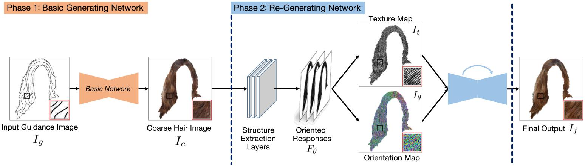






<link rel="stylesheet" href="/glyphicons/css/glyphicons.css">

<h1 style="text-align:center;">Two-phase Hair Image Synthesis by Self-Enhancing Generative Model</h1>

---

<p style="text-align:center;">
	Haonan Qiu<sup>1</sup>&nbsp;&nbsp;
	<a href="/index.html">Chuan Wang</a><sup>2</sup>&nbsp;&nbsp;
	Hang Zhu<sup>1</sup>&nbsp;&nbsp;
	Xiangyu Zhu<sup>1</sup>&nbsp;&nbsp;
	Jinjin Gu<sup>1</sup>&nbsp;&nbsp;
	<a href="http://sse.cuhk.edu.cn/en/content/7360">Xiaoguang Han</a><sup>1</sup>&nbsp;
</p>

<p style="text-align:center;">
	<sup>1</sup>CUHK (Shenzhen) &nbsp;&nbsp;&nbsp;&nbsp;&nbsp;&nbsp;&nbsp;&nbsp;&nbsp;&nbsp;
	&nbsp;&nbsp;&nbsp;&nbsp;&nbsp;
	<sup>2</sup>Megvii Technology
</p>

<p style="text-align:center;">
	<i>Accepted by Computer Graphics Forum, Pacific Graphics 2019</i>
</p>

<p style="text-align:center;">
	<i>arXiv <a href="https://arxiv.org/pdf/1902.11203.pdf">https://arxiv.org/pdf/1902.11203</a></i>
</p>

<p style="margin-bottom: 30px; text-align:center;">
	
  Figure: The architecture of our framework is composed of two phases.
</p>

### Abstract
<p style="text-align: justify;
    text-justify: inter-word;">
Generating plausible hair image given limited guidance, such as sparse sketches or low-resolution image, has been made possible with the rise of Generative Adversarial Networks (GANs). Traditional image-to-image translation networks can generate recognizable results, but finer textures are usually lost and blur artifacts commonly exist. In this paper, we propose a two-phase generative model for high-quality hair image synthesis. The two-phase pipeline first generates a coarse image by an existing image translation model, then applies a re-generating network with self-enhancing capability to the coarse image. The self-enhancing capability is achieved by a proposed differentiable layer, which extracts the structural texture and orientation maps from a hair image. Extensive experiments on two tasks, Sketch2Hair and Hair Super-Resolution, demonstrate that our approach is able to synthesize plausible hair image with finer details, and reaches the state-of-the-art.
</p>

---

### Downloads
<table style="width:600px">
<tr>
<td markdown="1">

||<em class="icon-file"/>||[paper](paper.pdf)||

</td>
</tr>

<!--
<tr>
<td markdown="1">

||<em class="icon-download"/>||[supplemental video results](./sup-aaai-video-demos.zip)||

</td> 
</tr>

<tr>
<td markdown="1">

||<em class="icon-github"/>||source code (coming soon)||

</td> 
</tr>

<tr>
<td markdown="1">

||<em class="icon-keynote"/>||[Slides](slides.pptx)||

</td> 
</tr>
-->

</table>

---

<!--
### Video Demo

<p style="margin-bottom: 30px; text-align:center; width=100%;">
<iframe width="100%" height="480" src="https://www.youtube.com/embed/uaHJC_6hJYk" frameborder="0" allow="accelerometer; autoplay; encrypted-media; gyroscope; picture-in-picture" allowfullscreen></iframe>
</p>

---

-->

### Bibtex


```bibtex
@article{qiu2019two,
  title={Two-phase Hair Image Synthesis by Self-Enhancing Generative Model},
  author={Qiu, Haonan and Wang, Chuan and Zhu, Hang and Zhu, Xiangyu and Gu, Jinjin and Han, Xiaoguang},
  journal={arXiv preprint arXiv:1902.11203},
  year={2019}
}
```

<!--<table style="width:100%">
<col width="20%">
<col width="10">
<col >

</table>-->

<style type="text/css">
td {
    border: 0.5px;
    vertical-align: center;
    text-align: left;
}
</style>
