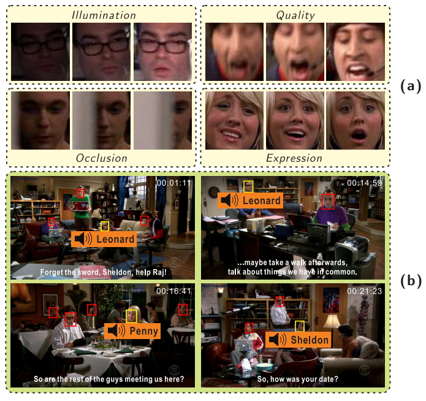






<link rel="stylesheet" href="/glyphicons/css/glyphicons.css">

<h1 style="text-align:center;">Look, Listen and Learn - A Multimodal LSTM for Speaker Identification</h1>

---

<p style="text-align:center;">
    <a href="http://www.jimmyren.com/">Jimmy SJ. Ren</a><sup>1</sup>
	<a href="http://herohuyongtao.github.io/">Yongtao Hu</a><sup>2</sup>
	<a href="http://gdriv.es/yuwing">Yu-Wing Tai</a><sup>1</sup>
	<a href="http://i.cs.hku.hk/~cwang/">Chuan Wang</a><sup>2</sup>
	<a href="http://lxu.me/">Li Xu</a><sup>1</sup>
	<a href="https://www.linkedin.com/in/wenxiu-sun-bb6b292b">Wenxiu Sun</a><sup>1</sup>
	<a href="http://www.yan-qiong.com/">Qiong Yan</a><sup>1</sup>
</p>

<p style="text-align:center;">
	<sup>1</sup>SenseTime Group Limited, Hong Kong
	&nbsp;&nbsp;&nbsp;&nbsp;
	<sup>2</sup>The University of Hong Kong, Hong Kong
</p>

<p style="text-align:center;">
	<i>The 30th AAAI Conference on Artificial Intelligence (AAAI 2016)</i>
</p>

<p style="text-align:center;">
	
</p>

<p style="margin-bottom: 30px; text-align:center;">
	Figure: (a) Face sequence with different kinds of degradations and variations. Using the previous CNN methods cannot recognize the speakers correctly. In contrast, the speakers can be successfully recognized by our LSTM in both single-modal and multimodal settings. (b) Our multimodal LSTM is robust to both image degradation and distractors. Yellow bounding boxes are the speakers. Red bounding boxes are the non-speakers, the distractors.
</p>

### Abstract
<p style="text-align: justify; text-justify: inter-word;">
	Speaker identification refers to the task of localizing the face of a person who has the same identity as the ongoing voice in a video. This task not only requires collective perception over both visual and auditory signals, the robustness to handle severe quality degradations and unconstrained content variations are also indispensable. In this paper, we describe a novel multimodal Long Short-Term Memory (LSTM) architecture which seamlessly unifies both visual and auditory modalities from the beginning of each sequence input. The key idea is to extend the conventional LSTM by not only sharing weights across time steps, but also sharing weights across modalities. We show that modeling the temporal dependency across face and voice can significantly improve the robustness to content quality degradations and variations. We also found that our multimodal LSTM is robustness to distractors, namely the non-speaking identities. We applied our multimodal LSTM to The Big Bang Theory dataset and showed that our system outperforms the state-of-the-art systems in speaker identification with lower false alarm rate and higher recognition accuracy.
</p>

---

### Downloads
<table style="width:600px">
<tr>
<td markdown="1">

||<em class="icon-file"/>||[paper](paper.pdf)||

</td> 
</tr>

<tr>
<td markdown="1">

||<em class="icon-github"/>||[Source code & dataset](https://github.com/jimmy-ren/lstm_speaker_naming_aaai16)||

</td> 
</tr>

<tr>
<td markdown="1">

||<em class="icon-github"/>||[Updated version of multimodal LSTM and more applications](https://github.com/jimmy-ren/vLSTM)||

</td> 
</tr>
</table>

---

### Bibtex
```bibtex
@inproceedings{ren2016look,
  title={Look, Listen and Learn - A Multimodal LSTM for Speaker Identification},
  author={Ren, Jimmy SJ. and Hu, Yongtao and Tai, Yu-Wing and Wang, Chuan and Xu, Li and Sun, Wenxiu and Yan, Qiong},
  booktitle={Proceedings of the 30th AAAI Conference on Artificial Intelligence},
  pages={3581--3587},
  year={2016}
}
```

<!--<table style="width:100%">
<col width="20%">
<col width="10">
<col >

</table>-->

<style type="text/css">
td {
    border: 0.5px;
    vertical-align: center;
    text-align: left;
}
</style>
