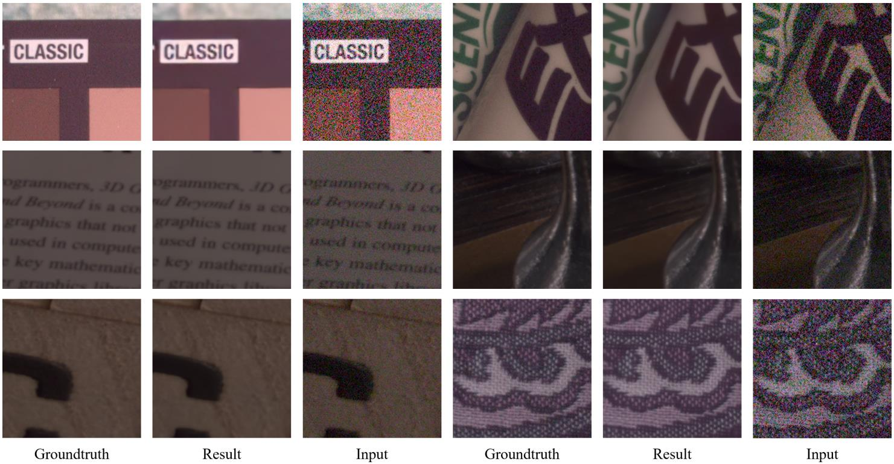






<link rel="stylesheet" href="/glyphicons/css/glyphicons.css">

<h1 style="text-align:center;">Learning Raw Image Denoising with Bayer Pattern Unification and Bayer Preserving Augmentation</h1>

---

<p style="text-align:center;">
	Jiaming Liu<sup>1</sup>&nbsp;&nbsp;
	Chi-Hao Wu<sup>1</sup>&nbsp;&nbsp;
	Yuzhi Wang<sup>2</sup>&nbsp;&nbsp;
	Qin Xu<sup>1</sup>&nbsp;&nbsp;
	Yuqian Zhou<sup>1</sup>&nbsp;&nbsp;
	<a href="https://brotherhuang.github.io/">Haibin Huang</a><sup>1</sup>&nbsp;&nbsp;<br>
	<a href="/index.html">Chuan Wang</a><sup>1</sup>&nbsp;&nbsp;
	Shaofan Cai<sup>1</sup>&nbsp;&nbsp;
	Yifan Ding<sup>3,1</sup>&nbsp;&nbsp;
	Haoqiang Fan<sup>1</sup>&nbsp;&nbsp;
	<a href="http://www.juew.org/">Jue Wang</a><sup>2</sup>&nbsp;
</p>

<p style="text-align:center;">
	<sup>1</sup>Megvii Technology &nbsp;&nbsp;&nbsp;&nbsp;&nbsp;&nbsp;&nbsp;&nbsp;&nbsp;&nbsp;
	&nbsp;&nbsp;&nbsp;&nbsp;&nbsp;
	<sup>2</sup>Tsinghua University &nbsp;&nbsp;&nbsp;&nbsp;&nbsp;&nbsp;&nbsp;&nbsp;&nbsp;&nbsp;
	&nbsp;&nbsp;&nbsp;&nbsp;&nbsp;
	<sup>3</sup>University of Central Florida
</p>

<p style="text-align:center;">
	<i>Accepted by CVPR Workshop 2019 <br>Winner Award (Top 1) in NTIRE 2019 Challenge on Real Image Denoising</i>
</p>

<p style="text-align:center;">
	<i>arXiv <a href="https://arxiv.org/pdf/1904.12945.pdf">https://arxiv.org/pdf/1904.12945</a></i>
</p>

<p style="margin-bottom: 30px; text-align:center;">
	
  Figure:  Our results on NTIRE 2019 Real Image Denoising Challenge (Track 1, Top 1) validation set.
</p>

### Abstract
<p style="text-align: justify;
    text-justify: inter-word;">
In this paper, we present new data pre-processing and augmentation techniques for DNN-based raw image denoising. Compared with traditional RGB image denoising, performing this task on direct camera sensor readings
presents new challenges such as how to effectively handle various Bayer patterns from different data sources, and subsequently how to perform valid data augmentation with raw images. To address the first problem, we propose a Bayer pattern unification (BayerUnify) method to unify different Bayer patterns. This allows us to fully utilize a heterogeneous dataset to train a single denoising model instead of training one model for each pattern. Furthermore, while it is essential to augment the dataset to improve model generalization and performance, we discovered that it is error-prone to modify raw images by adapting augmentation methods designed for RGB images. Towards this end, we present a Bayer preserving augmentation (BayerAug) method as an effective approach for raw image augmentation. Combining these data processing technqiues with a modified U-Net, our method achieves a PSNR of 52.11 and a SSIM of 0.9969 in NTIRE 2019 Real Image Denoising Challenge, demonstrating the state-of-the-art performance. Our code is available at https://github.com/Jiaming-Liu/BayerUnifyAug.
</p>

---

### Downloads
<table style="width:600px">
<tr>
<td markdown="1">

||<em class="icon-file"/>||[paper](paper.pdf)||

</td>
</tr>

<tr>
<td markdown="1">

||<em class="icon-github"/>||[code](https://github.com/Jiaming-Liu/BayerUnifyAug)||

</td> 
</tr>

<!--
<tr>
<td markdown="1">

||<em class="icon-download"/>||[supplemental video results](./sup-aaai-video-demos.zip)||

</td> 
</tr>

<tr>
<td markdown="1">

||<em class="icon-github"/>||source code (coming soon)||

</td> 
</tr>

<tr>
<td markdown="1">

||<em class="icon-keynote"/>||[Slides](slides.pptx)||

</td> 
</tr>
-->

</table>

---

<!--
### Video Demo

<p style="margin-bottom: 30px; text-align:center; width=100%;">
<iframe width="100%" height="480" src="https://www.youtube.com/embed/uaHJC_6hJYk" frameborder="0" allow="accelerometer; autoplay; encrypted-media; gyroscope; picture-in-picture" allowfullscreen></iframe>
</p>

---

-->

### Bibtex


```bibtex
@inproceedings{liu2019learning,
  title={Learning Raw Image Denoising with Bayer Pattern Unification and Bayer Preserving Augmentation},
  author={Liu, Jiaming and Wu, Chi-Hao and Wang, Yuzhi and Xu, Qin and Zhou, Yuqian and Huang, Haibin and Wang, Chuan and Cai, Shaofan and Ding, Yifan and Fan, Haoqiang and others},
  booktitle={Proceedings of the IEEE Conference on Computer Vision and Pattern Recognition Workshops},
  pages={0--0},
  year={2019}
}

```

<!--<table style="width:100%">
<col width="20%">
<col width="10">
<col >

</table>-->

<style type="text/css">
td {
    border: 0.5px;
    vertical-align: center;
    text-align: left;
}
</style>
