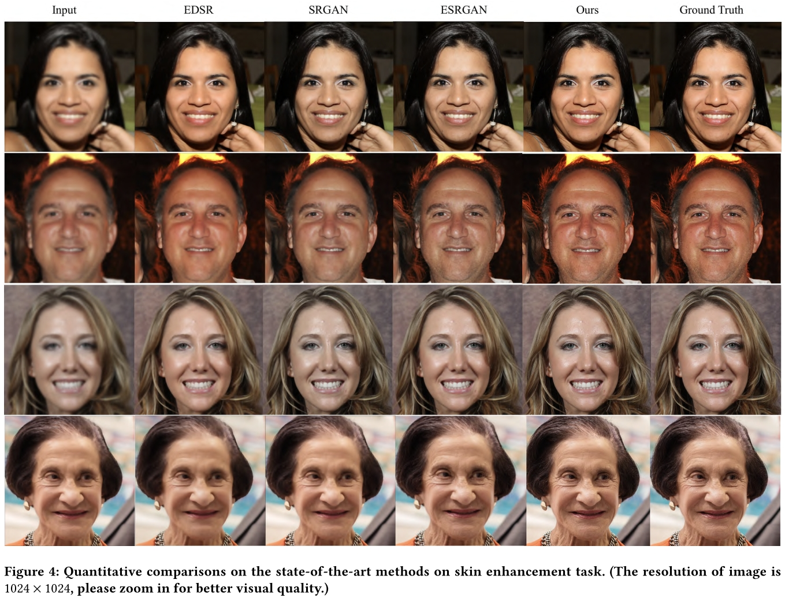






<link rel="stylesheet" href="/glyphicons/css/glyphicons.css">

<h1 style="text-align:center;">Skin Textural Generation via Blue-Noise Gabor
Filtering based Generative Adversarial Network</h1>

---

<p style="text-align:center;">
	<a href="/index.html">Hui Zhang</a><sup>1</sup>&nbsp;&nbsp;
	<a href="/index.html">Chuan Wang</a><sup>2&dagger;</sup>&nbsp;&nbsp;
	<a href="/index.html">Nenglun Chen</a><sup>1</sup>&nbsp;&nbsp;
	<a href="http://www.juew.org/">Jue Wang</a><sup>2</sup>&nbsp;&nbsp;
	<a href="https://www.cs.hku.hk/people/academic-staff/wenping">Wenping Wang</a><sup>1</sup>&nbsp;
</p>

<p style="text-align:center;">
	<sup>1</sup>The University of Hong Kong &nbsp;&nbsp;&nbsp;&nbsp;&nbsp;&nbsp;&nbsp;&nbsp;&nbsp;&nbsp;
	&nbsp;&nbsp;&nbsp;&nbsp;&nbsp;
	<sup>2</sup>Megvii Technology &nbsp;&nbsp;&nbsp;&nbsp;&nbsp;&nbsp;&nbsp;&nbsp;&nbsp;&nbsp;
	&nbsp;&nbsp;&nbsp;&nbsp;&nbsp;
</p>

<p style="text-align:center;">
	<sup>&dagger;</sup>Corresponding Author
</p>

<p style="text-align:center;">
	<i>Accepted by ACM MM 2020</i>
</p>

<p style="margin-bottom: 30px; text-align:center;">
	
</p>

### Abstract
<p style="text-align: justify;
    text-justify: inter-word;">
Facial skin texture systhesis is a fundamental problem in high quality facial image generation and enhancement. The key behind is how to effectively synthesize plausible textured noise for the faces. With the development of CNNs and GANs, most works cast the problem as an image to image translation problem. However, these methods lack
explicit machenism to simulate the facial noise pattern, so that the generated images are of obvious artifacts. To this end, we propose a new facial noise generation method. Specifically, we utilize the property of blue noise and gabor filter to implicitly guide the asymmetrical sampling for the face region as a guidance map, where non-uniform
point sampling is conducted. Thus we propose a novel Blue-Noise Gabor Module so as to produce a spatial-variant noisy image. Our proposed two-branch framework combined facial identity enhancing with textures details generation to jointly produce a high-quality facial image. Experimental results demonstrate the superiority of
our method compared with the state-of-the-arts, which enables the generation of high quality facial texture based on a 2D image only, without the involvement of any 3D models.
</p>

---

### Downloads
<table style="width:600px">
<tr>
<td markdown="1">

||<em class="icon-file"/>||[paper](paper.pdf)||

</td> 
</tr>

<!--
<tr>
<td markdown="1">

||<em class="icon-download"/>||[supplemental video results](./sup-aaai-video-demos.zip)||

</td> 
</tr>

<tr>
<td markdown="1">

||<em class="icon-github"/>||source code (coming soon)||

</td> 
</tr>

<tr>
<td markdown="1">

||<em class="icon-keynote"/>||[Slides](slides.pptx)||

</td> 
</tr>
-->

</table>

---

<!--
### Video Demo

<p style="margin-bottom: 30px; text-align:center; width=100%;">
<iframe width="100%" height="480" src="https://www.youtube.com/embed/uaHJC_6hJYk" frameborder="0" allow="accelerometer; autoplay; encrypted-media; gyroscope; picture-in-picture" allowfullscreen></iframe>
</p>

---

-->

### Bibtex


```bibtex
@article{zhang2020skin,
  title={Skin Textural Generation via Blue-Noise Gabor Filtering based Generative Adversarial Network},
  author={Zhang, Hui and Wang, Chuan and Chen, Nenglun and Wang, Jue and Wang, Wenping},
  journal={ACM Multimedia},
  year={2020}
}
```

<!--<table style="width:100%">
<col width="20%">
<col width="10">
<col >

</table>-->

<style type="text/css">
td {
    border: 0.5px;
    vertical-align: center;
    text-align: left;
}
</style>
