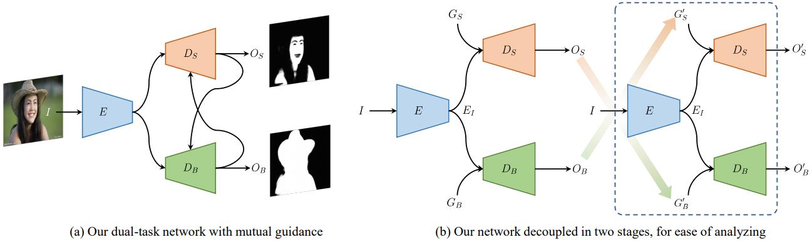






<link rel="stylesheet" href="/glyphicons/css/glyphicons.css">

<h1 style="text-align:center;">Semi-supervised Skin Detection by Network with Mutual Guidance</h1>

---

<p style="text-align:center;">
	<a href="/index.html">Yi He</a><sup>1*</sup>&nbsp;&nbsp;
	<a href="/index.html">Jiayuan Shi</a><sup>2*</sup>&nbsp;&nbsp;
	<a href="/index.html">Chuan Wang</a><sup>2&dagger;</sup>&nbsp;&nbsp;
	<a href="https://brotherhuang.github.io/">Haibin Huang</a><sup>2</sup>&nbsp;&nbsp;
	<a href="/index.html">Jiaming Liu</a><sup>2</sup>&nbsp;&nbsp;
	<a href="http://guanbinli.com/">Guanbin Li</a><sup>3</sup>&nbsp;&nbsp;
	<a href="http://dutmedia.org/risheng-liu/">Risheng Liu</a><sup>1</sup>&nbsp;&nbsp;
	<a href="http://www.juew.org/">Jue Wang</a><sup>2</sup>&nbsp;
</p>

<p style="text-align:center;">
	<sup>1</sup>Dalian University of Technology &nbsp;&nbsp;&nbsp;&nbsp;&nbsp;&nbsp;&nbsp;&nbsp;&nbsp;&nbsp;
	&nbsp;&nbsp;&nbsp;&nbsp;&nbsp;
	<sup>2</sup>Megvii Technology &nbsp;&nbsp;&nbsp;&nbsp;&nbsp;&nbsp;&nbsp;&nbsp;&nbsp;&nbsp;
	&nbsp;&nbsp;&nbsp;&nbsp;&nbsp;
	<sup>3</sup>Sun Yat-sen University
</p>

<p style="text-align:center;">
	<sup>*</sup>Equal Contributors &nbsp;&nbsp;&nbsp;&nbsp;&nbsp;&nbsp;&nbsp;&nbsp;&nbsp;&nbsp;
	&nbsp;&nbsp;&nbsp;&nbsp;&nbsp;
	<sup>&dagger;</sup>Corresponding Author
</p>

<p style="text-align:center;">
	<i>Accepted by ICCV 2019</i>
</p>

<p style="text-align:center;">
	<i>arXiv <a href="https://arxiv.org/pdf/1908.01977.pdf">https://arxiv.org/pdf/1908.01977</a></i>
</p>

<p style="margin-bottom: 30px; text-align:center;">
	
  Figure: Structure of our dual-task network with mutual guidance. (a) The original network structure with mutual guidance loop. (b) The
decoupled network into two stages for ease of analyzing.
</p>

### Abstract
<p style="text-align: justify;
    text-justify: inter-word;">
In this paper we present a new data-driven method for robust skin detection from a single human portrait image. Unlike previous methods, we incorporate human body as a weak semantic guidance into this task, considering acquiring large-scale of human labeled skin data is commonly expensive and time-consuming. To be specific, we propose a dual-task neural network for joint detection of skin and body via a semi-supervised learning strategy. The dualtask network contains a shared encoder but two decoders for skin and body separately. For each decoder, its output also serves as a guidance for its counterpart, making both decoders mutually guided. Extensive experiments were conducted to demonstrate the effectiveness of our network with mutual guidance, and experimental results show our network outperforms the state-of-the-art in skin detection.
</p>

---

### Downloads
<table style="width:600px">
<tr>
<td markdown="1">

||<em class="icon-file"/>||[paper](paper.pdf)||

</td> 
</tr>

<!--
<tr>
<td markdown="1">

||<em class="icon-download"/>||[supplemental video results](./sup-aaai-video-demos.zip)||

</td> 
</tr>

<tr>
<td markdown="1">

||<em class="icon-github"/>||source code (coming soon)||

</td> 
</tr>

<tr>
<td markdown="1">

||<em class="icon-keynote"/>||[Slides](slides.pptx)||

</td> 
</tr>
-->

</table>

---

<!--
### Video Demo

<p style="margin-bottom: 30px; text-align:center; width=100%;">
<iframe width="100%" height="480" src="https://www.youtube.com/embed/uaHJC_6hJYk" frameborder="0" allow="accelerometer; autoplay; encrypted-media; gyroscope; picture-in-picture" allowfullscreen></iframe>
</p>

---

-->

### Bibtex


```bibtex
@article{he2019semi,
  title={Semi-supervised Skin Detection by Network with Mutual Guidance},
  author={He, Yi and Shi, Jiayuan and Wang, Chuan and Huang, Haibin and Liu, Jiaming and Li, Guanbin and Liu, Risheng and Wang, Jue},
  journal={arXiv preprint arXiv:1908.01977},
  year={2019}
}
```

<!--<table style="width:100%">
<col width="20%">
<col width="10">
<col >

</table>-->

<style type="text/css">
td {
    border: 0.5px;
    vertical-align: center;
    text-align: left;
}
</style>
