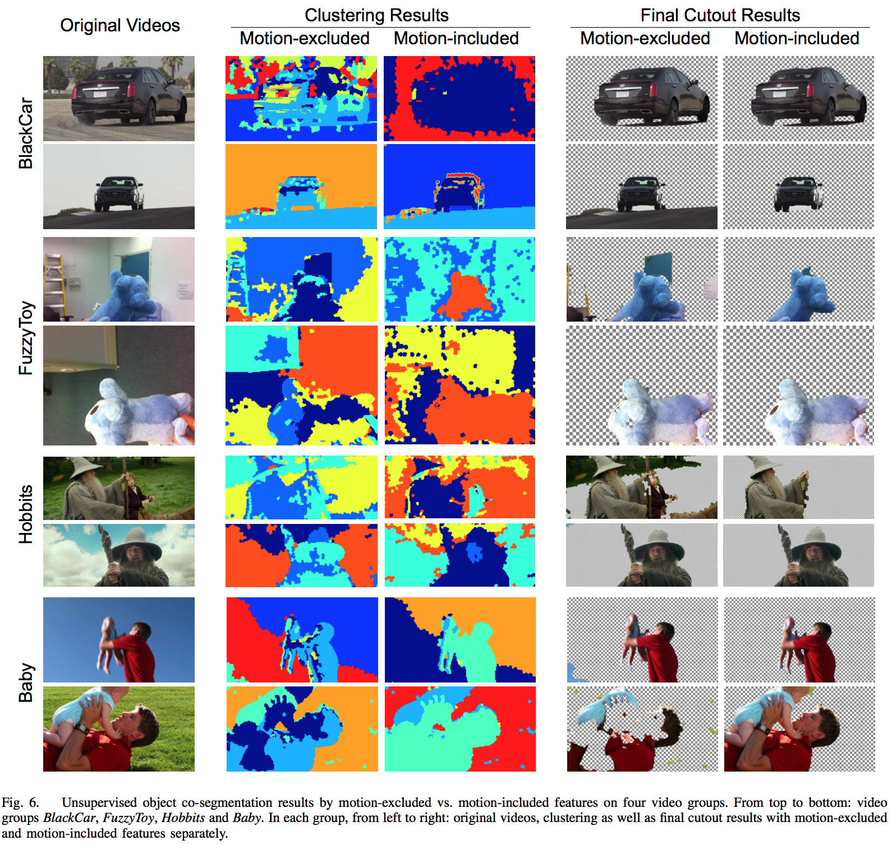






<link rel="stylesheet" href="/glyphicons/css/glyphicons.css">

<h1 style="text-align:center;">Video Object Co-segmentation via Subspace Clustering and Quadratic Pseudo-Boolean Optimization in an MRF Framework</h1>

---

<p style="text-align:center;">
	<a href="/index.html">Chuan Wang</a><sup>1</sup>&nbsp;
	<a href="http://cs.nju.edu.cn/ywguo/">Yanwen Guo</a><sup>2</sup>&nbsp;
	Jie Zhu<sup>2</sup>&nbsp;
	<a href="http://imc.ahu.edu.cn/wanglb.html">Linbo Wang</a><sup>2</sup>&nbsp;
	<a href="https://www.cs.hku.hk/research/profile.jsp?teacher=wenping">Wenping Wang</a><sup>1</sup>&nbsp;
</p>

<p style="text-align:center;">
	<sup>1</sup>The University of Hong Kong&nbsp;&nbsp;&nbsp;&nbsp;&nbsp;&nbsp;&nbsp;&nbsp;&nbsp;&nbsp;
	&nbsp;&nbsp;&nbsp;&nbsp;&nbsp;&nbsp;&nbsp;&nbsp;&nbsp;&nbsp;
	<sup>2</sup>Nanjing University, China
</p>

<p style="text-align:center;">
	<i>IEEE Transactions on Image Multimedia, Volume: 16, Issue: 4, 2014</i>
</p>

<p style="margin-bottom: 30px">
	
</p>

### Abstract
<p style="text-align: justify;
    text-justify: inter-word;">
    Multiple videos may share a common foreground object, for instance a family member in home videos, or a leading role in various clips of a movie or TV series. In this paper, we present a novel method for co-segmenting the common foreground object from a group of video sequences. The issue was seldom touched on in the literature.
</p>
<p style="text-align: justify;
    text-justify: inter-word;">
    Starting from over-segmentation of each video into Temporal Superpixels (TSPs), we first propose a new subspace clustering algorithm which segments the videos into consistent spatio-temporal regions with multiple classes, such that the common foreground has consistent labels across different videos. The subspace clustering algorithm exploits the fact that across different videos the common foreground shares similar appearance features, while motions can be used to better differentiate regions within each video, making accurate extraction of object boundaries easier. We further formulate video object co-segmentation as a Markov Random Field (MRF) model which imposes the constraint of foreground model automatically computed or specified with little user effort. The Quadratic Pseudo-Boolean Optimization (QPBO) is used to generate the results. Experiments show that this video co-segmentation framework can achieve good quality foreground extraction results without user interaction for those videos with unrelated background, and with only moderate user interaction for those videos with similar background. Comparisons with previous work also show the superiority of our approach.
</p>


---

### Downloads
<table style="width:200px">
<tr>
<td markdown="1">

||<em class="icon-file"/>||[paper](paper.pdf)||

</td> 
</tr>

<tr>
<td markdown="1">

||<em class="icon-film"/>||[video demo](https://youtu.be/vbeN6JMkuGk)||

</td> 
</tr>
</table>

---

### Bibtex
```bibtex
@article{wang2014video,
  title={Video object co-segmentation via subspace clustering and quadratic pseudo-boolean optimization in an MRF framework},
  author={Wang, Chuan and Guo, Yanwen and Zhu, Jie and Wang, Linbo and Wang, Wenping},
  journal={IEEE Transactions on Multimedia},
  volume={16},
  number={4},
  pages={903--916},
  year={2014},
  publisher={IEEE}
}
```

<!--<table style="width:100%">
<col width="20%">
<col width="10">
<col >

</table>-->

<style type="text/css">
td {
    border: 0.5px;
    vertical-align: center;
    text-align: left;
}
</style>
