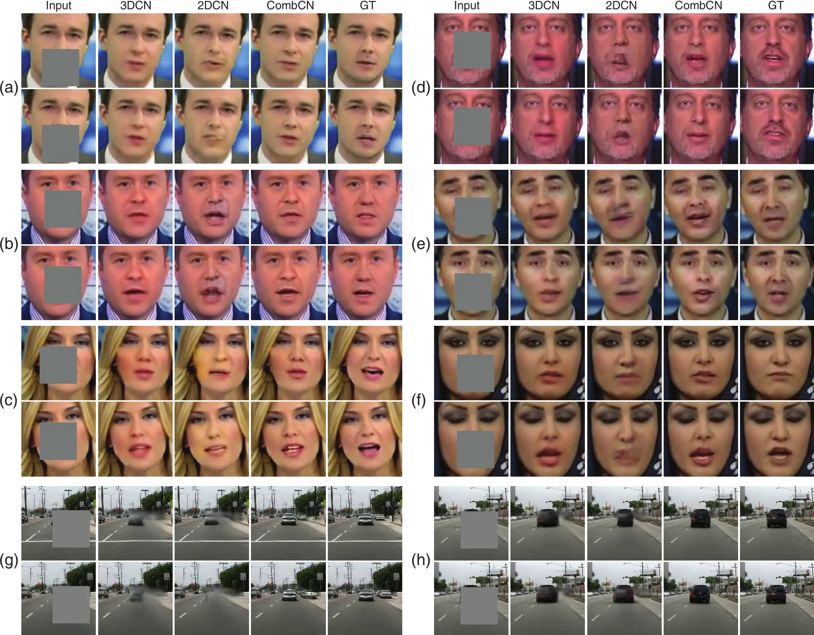






<link rel="stylesheet" href="/glyphicons/css/glyphicons.css">

<h1 style="text-align:center;">Video Inpainting by Jointly Learning Temporal Structure and Spatial Details</h1>

---

<p style="text-align:center;">
	<a href="/index.html">Chuan Wang</a><sup>1</sup>&nbsp;
	<a href="https://brotherhuang.github.io/">Haibin Huang</a><sup>1</sup>&nbsp;
	<a href="https://i.cs.hku.hk/~xghan/">Xiaoguang Han</a><sup>2</sup>&nbsp;
	<a href="http://www.juew.org/">Jue Wang</a><sup>1</sup>&nbsp;
</p>

<p style="text-align:center;">
	<sup>1</sup>Megvii (Face++) USA&nbsp;&nbsp;&nbsp;&nbsp;&nbsp;&nbsp;&nbsp;&nbsp;&nbsp;&nbsp;
	&nbsp;&nbsp;&nbsp;&nbsp;&nbsp;&nbsp;&nbsp;&nbsp;&nbsp;&nbsp;
	<sup>2</sup>Shenzhen Research Inst. of Big Data, CUHK (Shenzhen)
</p>

<p style="text-align:center;">
	<i>The 33th AAAI Conference on Artificial Intelligence (AAAI 2019)</i>
</p>

<p style="text-align:center;">
	<i>arXiv <a href="https://arxiv.org/abs/1806.08482">https://arxiv.org/abs/1806.08482</a></i>
</p>

<p style="margin-bottom: 30px; text-align:center;">
	
  Figure: Inpainted frames on datasets FaceForensics (a ~ f) and Caltech (g, h). In each panel, the two rows represent two frames of a video, and the five columns from left to right are input, results by 3DCN, 2DCN and CombCN (ours), as well as the target ground truth.
</p>

### Abstract
<p style="text-align: justify;
    text-justify: inter-word;">
  We present a new data-driven video inpainting method for recovering missing regions of video frames. A novel deep learning architecture is proposed which contains two sub-networks: a temporal structure inference network and a spatial detail recovering network. The temporal structure inference network is built upon a 3D fully convolutional architecture: It only learns to complete a low-resolution video volume given the expensive computational cost of 3D convolution. The low resolution result provides temporal guidance to the spatial detail recovering network, which performs image-based inpainting with a 2D fully convolutional network to produce recovered video frames in their original resolution. Such two-step network design ensures both the spatial quality of each frame and the temporal coherence across frames. Our method jointly trains both sub-networks in an end-to-end manner. We provide qualitative and quantitative evaluation three datasets, demonstrating that our method outperforms previous learning-based video inpainting methods.
</p>

---

### Downloads
<table style="width:600px">
<tr>
<td markdown="1">

||<em class="icon-file"/>||[paper](paper.pdf)||

</td> 
</tr>

<tr>
<td markdown="1">

||<em class="icon-download"/>||[supplemental video results](./sup-aaai-video-demos.zip)||

</td> 
</tr>

<tr>
<td markdown="1">

||<em class="icon-github"/>||source code (coming soon)||

</td> 
</tr>

<tr>
<td markdown="1">

||<em class="icon-keynote"/>||[Slides](slides.pptx)||

</td> 
</tr>

<tr>
<td markdown="1">

||<em class="icon-posterous-spaces"/>||[Poster](poster.pdf)||

</td> 
</tr>

</table>

---

### Video Demo

<p style="margin-bottom: 30px; text-align:center; width=100%;">
<iframe width="100%" height="480" src="https://www.youtube.com/embed/uaHJC_6hJYk" frameborder="0" allow="accelerometer; autoplay; encrypted-media; gyroscope; picture-in-picture" allowfullscreen></iframe>
</p>

---


### Bibtex


```bibtex
@inproceedings{wang2018videoinp,
  title={Video Inpainting by Jointly Learning Temporal Structure and Spatial Details},
  author={Wang, Chuan and Huang, Haibin and Han, Xiaoguang and Wang, Jue},
  booktitle={Proceedings of the 33th AAAI Conference on Artificial Intelligence},
  year={2019}
}
```

<!--<table style="width:100%">
<col width="20%">
<col width="10">
<col >

</table>-->

<style type="text/css">
td {
    border: 0.5px;
    vertical-align: center;
    text-align: left;
}
</style>
