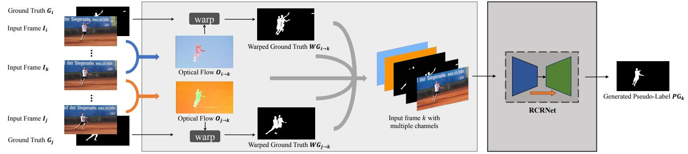






<link rel="stylesheet" href="/glyphicons/css/glyphicons.css">

<h1 style="text-align:center;">Semi-Supervised Video Salient Object Detection Using Pseudo-Labels</h1>

---

<p style="text-align:center;">
	Pengxiang Yan<sup>1</sup>&nbsp;&nbsp;
	<a href="http://guanbinli.com/">Guanbin Li</a><sup>1</sup>&nbsp;&nbsp;
	Yuan Xie<sup>1</sup>&nbsp;&nbsp;
	<a href="http://sse.cuhk.edu.cn/en/content/7517">Zhen Li</a><sup>2</sup>&nbsp;&nbsp;
	<a href="/index.html">Chuan Wang</a><sup>3</sup>&nbsp;&nbsp;
	Tianshui Chen<sup>1</sup>&nbsp;&nbsp;
	<a href="http://www.linliang.net/">Liang Lin</a><sup>1</sup>&nbsp;
</p>

<p style="text-align:center;">
	<sup>1</sup>Sun Yat-sen University &nbsp;&nbsp;&nbsp;&nbsp;&nbsp;&nbsp;&nbsp;&nbsp;&nbsp;&nbsp;
	&nbsp;&nbsp;&nbsp;&nbsp;&nbsp;
	<sup>2</sup>CUHK (Shenzhen) &nbsp;&nbsp;&nbsp;&nbsp;&nbsp;&nbsp;&nbsp;&nbsp;&nbsp;&nbsp;
	&nbsp;&nbsp;&nbsp;&nbsp;&nbsp;
	<sup>3</sup>Megvii Technology
</p>

<p style="text-align:center;">
	<i>Accepted by ICCV 2019</i>
</p>

<!--
<p style="text-align:center;">
	<i>arXiv <a href="https://arxiv.org/pdf/1908.01977.pdf">https://arxiv.org/pdf/1908.01977</a></i>
</p>
-->

<p style="margin-bottom: 30px; text-align:center;">
	
  Figure: The architecture of our flow guided pseudo-label generation model (FGPLG)
</p>

### Abstract
<p style="text-align: justify;
    text-justify: inter-word;">
Deep learning based video salient object detection has
recently achieved great success with its performance significantly outperforming any other unsupervised methods.
However, existing data-driven approaches heavily rely on a large quantity of pixel-wise annotated video frames to deliver such promising results. In this paper, we address the semi-supervised video salient object detection task using pseudo-labels. Specifically, we present an effective video saliency detector that consists of a spatial refinement network and a spatiotemporal module. Based on the same refinement network and motion information in terms of optical flow, we further propose a novel method to generate pixellevel pseudo-labels from sparsely annotated frames. By utilizing the generated pseudo-labels together with a part of manual annotations, our video saliency detector learns spatial and temporal cues for both contrast inference and coherence enhancement, thus producing accurate saliency maps. Experimental results demonstrate that our proposed semi-supervised method even greatly outperforms all the state-of-the-art fully-supervised methods across three public benchmarks of VOS, DAVIS, and FBMS.
</p>

---

### Downloads
<table style="width:600px">
<tr>
<td markdown="1">

||<em class="icon-file"/>||[paper](https://arxiv.org/pdf/1908.04051.pdf)||

</td> 
</tr>

<!--
<tr>
<td markdown="1">

||<em class="icon-download"/>||[supplemental video results](./sup-aaai-video-demos.zip)||

</td> 
</tr>

<tr>
<td markdown="1">

||<em class="icon-github"/>||source code (coming soon)||

</td> 
</tr>

<tr>
<td markdown="1">

||<em class="icon-keynote"/>||[Slides](slides.pptx)||

</td> 
</tr>
-->

</table>

---

<!--
### Video Demo

<p style="margin-bottom: 30px; text-align:center; width=100%;">
<iframe width="100%" height="480" src="https://www.youtube.com/embed/uaHJC_6hJYk" frameborder="0" allow="accelerometer; autoplay; encrypted-media; gyroscope; picture-in-picture" allowfullscreen></iframe>
</p>

---

-->

### Bibtex


```bibtex
@article{yan2019semi,
  title={Semi-Supervised Video Salient Object Detection Using Pseudo-Labels},
  author={Yan, Pengxiang and Li, Guanbin and Xie, Yuan and Li, Zhen and Wang, Chuan and Chen, Tianshui and Lin, Liang},
  journal={arXiv preprint arXiv:1908.04051},
  year={2019}
}
```

<!--<table style="width:100%">
<col width="20%">
<col width="10">
<col >

</table>-->

<style type="text/css">
td {
    border: 0.5px;
    vertical-align: center;
    text-align: left;
}
</style>
