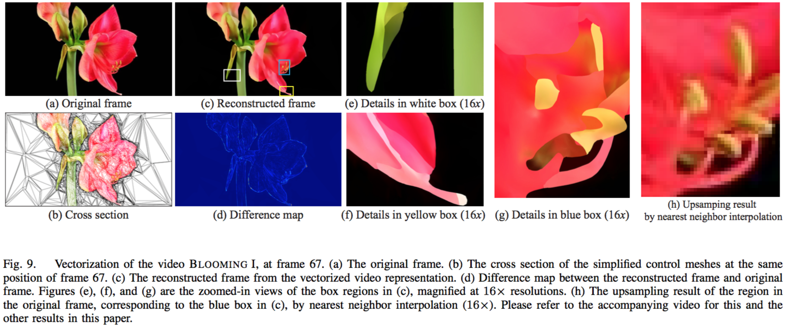






<link rel="stylesheet" href="/glyphicons/css/glyphicons.css">

<h1 style="text-align:center;">Video Vectorization via Tetrahedral Remeshing</h1>

---

<p style="text-align:center;">
	<a href="/index.html">Chuan Wang</a><sup>1</sup>&nbsp;
	Jie Zhu<sup>2</sup>&nbsp;
	<a href="http://cs.nju.edu.cn/ywguo/">Yanwen Guo</a><sup>2</sup>&nbsp;
	<a href="https://www.cs.hku.hk/research/profile.jsp?teacher=wenping">Wenping Wang</a><sup>1</sup>&nbsp;
</p>

<p style="text-align:center;">
	<sup>1</sup>The University of Hong Kong&nbsp;&nbsp;&nbsp;&nbsp;&nbsp;&nbsp;&nbsp;&nbsp;&nbsp;&nbsp;
	&nbsp;&nbsp;&nbsp;&nbsp;&nbsp;&nbsp;&nbsp;&nbsp;&nbsp;&nbsp;
	<sup>2</sup>Nanjing University, China
</p>

<p style="text-align:center;">
	<i>IEEE Transactions on Image Processing, 2017</i>
</p>

<p style="margin-bottom: 30px">
	
</p>

### Abstract
<p style="text-align: justify;
    text-justify: inter-word;">We present a video vectorization method that generates a video in vector representation from an input video in raster representation. A vector-based video representation offers the benefits of vector graphics, such as compactness and scalability. The vector video we generate is represented by a simplified tetrahedral control mesh over the spatial-temporal video volume, with color attributes defined at the mesh vertices. We present novel techniques for simplification and subdivision of a tetrahedral mesh to achieve high simplification ratio while preserving features and ensuring color fidelity. From an input raster video, our method is capable of generating a compact video in vector representation that allows a faithful reconstruction with low reconstruction errors.</p>

---

### Downloads
<table style="width:200px">
<tr>
<td markdown="1">

||<em class="icon-file"/>||[paper](paper.pdf)||

</td> 
</tr>
</table>

---

### Video Demo

<p style="margin-bottom: 30px; text-align:center; width=100%;">
<iframe width="100%" height="480" src="https://www.youtube.com/embed/KmPdjB8f4ww" frameborder="0" allowfullscreen></iframe>
</p>

---

### Bibtex
```bibtex
@article{wang2017video,
  title={Video Vectorization via Tetrahedral Remeshing},
  author={Wang, Chuan and Zhu, Jie and Guo, Yanwen and Wang, Wenping},
  journal={IEEE Transactions on Image Processing},
  volume={26},
  number={4},
  pages={1833--1844},
  year={2017},
  publisher={IEEE}
}
```

<!--<table style="width:100%">
<col width="20%">
<col width="10">
<col >

</table>-->

<style type="text/css">
td {
    border: 0.5px;
    vertical-align: center;
    text-align: left;
}
</style>
